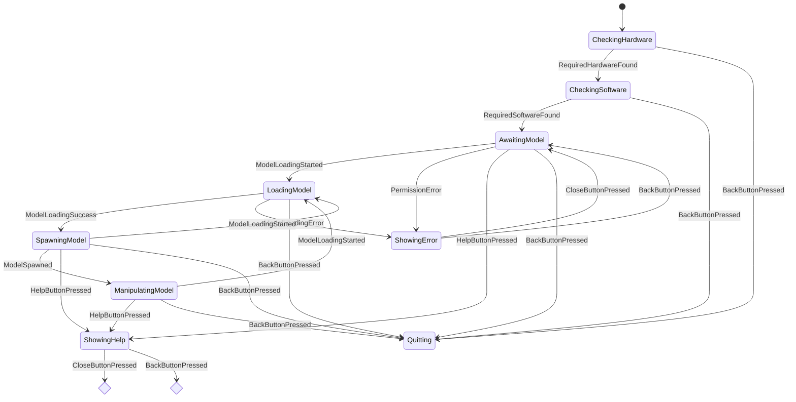

# Printables AR

An augmented reality (AR) mobile application for previewing 3D printing models in a real-world environment.

## Requirements

- [TriLib 2]
    - Source: https://assetstore.unity.com/packages/tools/modeling/trilib-2-model-loading-package-157548
    - Version: 2.4.4
- [DOTween]
    - Source: https://dotween.demigiant.com/download.php
    - Version: 1.2.765
- [XR Simulation Environments]
    - Source: https://github.com/Unity-Technologies/com.unity.xr-content.xr-sim-environments/releases/download/2.0.1/com.unity.xr-content.xr-sim-environments-2.0.1.tgz
    - Version: 2.0.1

## Application State Machine
Note: The diagram bellow was automatically generated by [UpdateStateDiagram](./Tools/)

## Development Status

- ~~Proof of Concept (POC) with obj Files~~
- ~~POC Code Cleaning and Refactoring~~
- ~~User Experience Enhancements~~
    - ~~1D / 2D Rotation Switch~~
    - ~~Gestures / Back Button Support~~
    - ~~Juiciness / Interaction Feedback~~
- ~~Support Additional File Formats~~
    - ~~stl~~
    - ~~3mf~~
- ~~UI Finalization~~
- ~~Stress Testing~~
- ~~Performance Optimization~~
- Application Publishing **(Work in Progress)**
	- Mandatory 14-day Google Play Closed Testing. Please contact me if you would like to participate.
